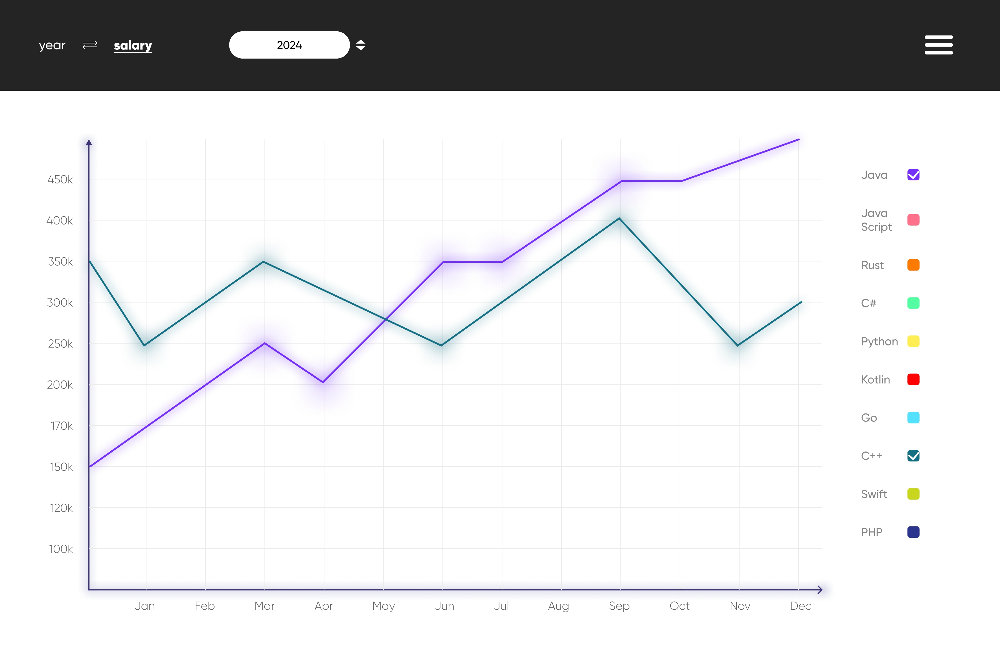

# RSRC

RSRC - Resource for Recruitment System Analysis and Collection of vacancies from various sources. This is a system for an analytical platform where information is collected and then analyzed, namely, information is collected from sources about interested users in certain services. The purpose is to offer users more favorable conditions.

## Visual diagram of the frontend

## Documentation

- Marketing
     - [Target audience](./docs/biz)
     - [Interested parties](./docs/biz)
     - [User stories](./docs/biz)
- Requirements
    - [Functional requirements](./docs/analysis/functional-requiremens.md)
    - [Non-functional requirements](./docs/analysis/nonfunctional-requirements.md)
- DevSecOps
    - [Assembly files](./docs/devsecops)
- Design overview
    - [Architecture](./docs/architecture/03-c4-diagrams-arch.md)
    - [MVP](./docs/architecture/02-mvp-arch.md)
    - [Api](./docs/architecture/01-api.md)
    - [Flow](./docs/architecture/04-flow.md)
- QA/MT
    - [Testing](./docs/testing)

